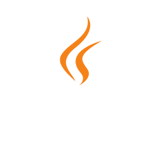
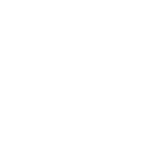

<div align="center">
  
  
  
</div>

<div align="center">
 
</div>

<div align="center">
  
</div>

<h3 align="center">🔖 A Passionate Software Developer based in Indonesia</h3>
<div align="center">
  <h3>☘️ Chasing a degree in informatics engineering while exploring the intricacies of coding</h3>
</div>
<div align="center">
  <h3>✨ Turning ideas into reality through clean and creative code</h3>
</div>

<div align="center">
 
</div>

</br>

<div align="center">
  
</div>

</br>

<div align="center">
   &nbsp;
   &nbsp;
   &nbsp;
   &nbsp;
   &nbsp;
   &nbsp;
   &nbsp;
   &nbsp;
   &nbsp;
   &nbsp;
   &nbsp;
   &nbsp;
   &nbsp;
   &nbsp;
   &nbsp;
</div>

<div align="center">
 
</div>

</br>
<table align="center">
<tr>
<td width="50%" valign="top">

### :open_file_folder: Project Structure

<pre>
heart-disease-detection/
├── config/
├── data/
│   ├── raw/
│   ├── processed/
│   └── external/
├── notebooks/
│   └── 01_eda_analysis.ipynb
├── models/
├── src/
│   ├── data_loader.py
│   ├── preprocessing.py
│   └── train_model.py
├── tests/
├── reports/
│   └── figures/
├── .gitignore
├── requirements.txt
└── README.md              
</pre>
</td>
<td width="50%" valign="top">

### :bulb: Core Philosophy

```python
from typing import List


def build_pipeline(steps: List[str]) -> None:
    for step in steps:
        print(f"🧩 [Pipeline] Now focusing on: {step}")


if __name__ == "__main__":
    project_steps: List[str] = [
        "Config & Data Paths",
        "Exploratory Data Analysis",
        "Preprocessing & Features",
        "Model Training & Evaluation",
        "Reports & Figures",
    ]

    build_pipeline(project_steps)
```
</td>
</tr>
<tr>
<td colspan="2" align="center">
<details>
<summary>:outbox_tray: Show Output</summary>
<sub>:jigsaw: [Pipeline] Now focusing on: Config & Data Paths</sub><br>  
<sub>:jigsaw: [Pipeline] Now focusing on: Exploratory Data Analysis</sub><br>  
<sub>:jigsaw: [Pipeline] Now focusing on: Preprocessing & Features</sub><br>  
<sub>:jigsaw: [Pipeline] Now focusing on: Model Training & Evaluation</sub><br>  
<sub>:jigsaw: [Pipeline] Now focusing on: Reports & Figures</sub><br>  
</details>
</td>
</tr>
<tr>
<td colspan="2" align="center">
<sub>&nbsp;&nbsp;<i>Building resilience through code...</i> &nbsp;|&nbsp; Last updated: Friday, 30 January 2026, 09:47 UTC+7</sub>
</td>
</tr>
</table>

<div align="center">
 
</div>

</br>


