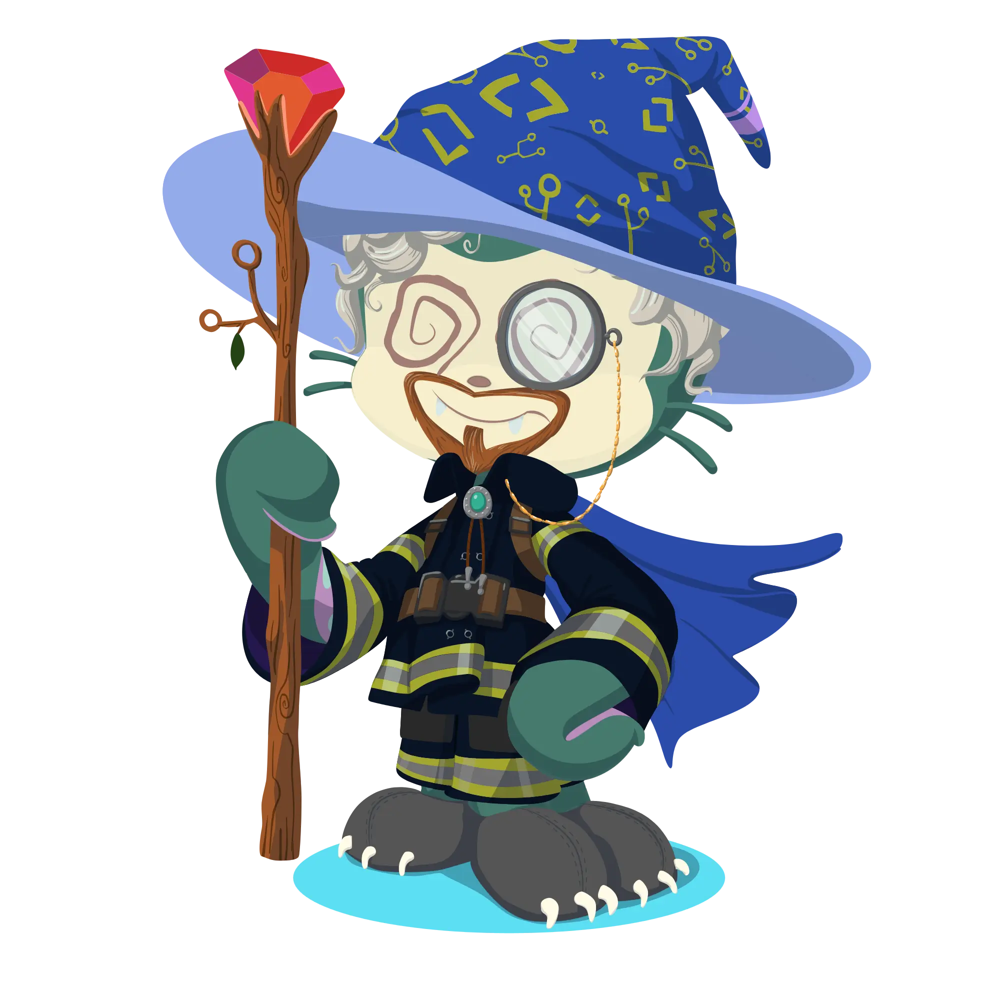
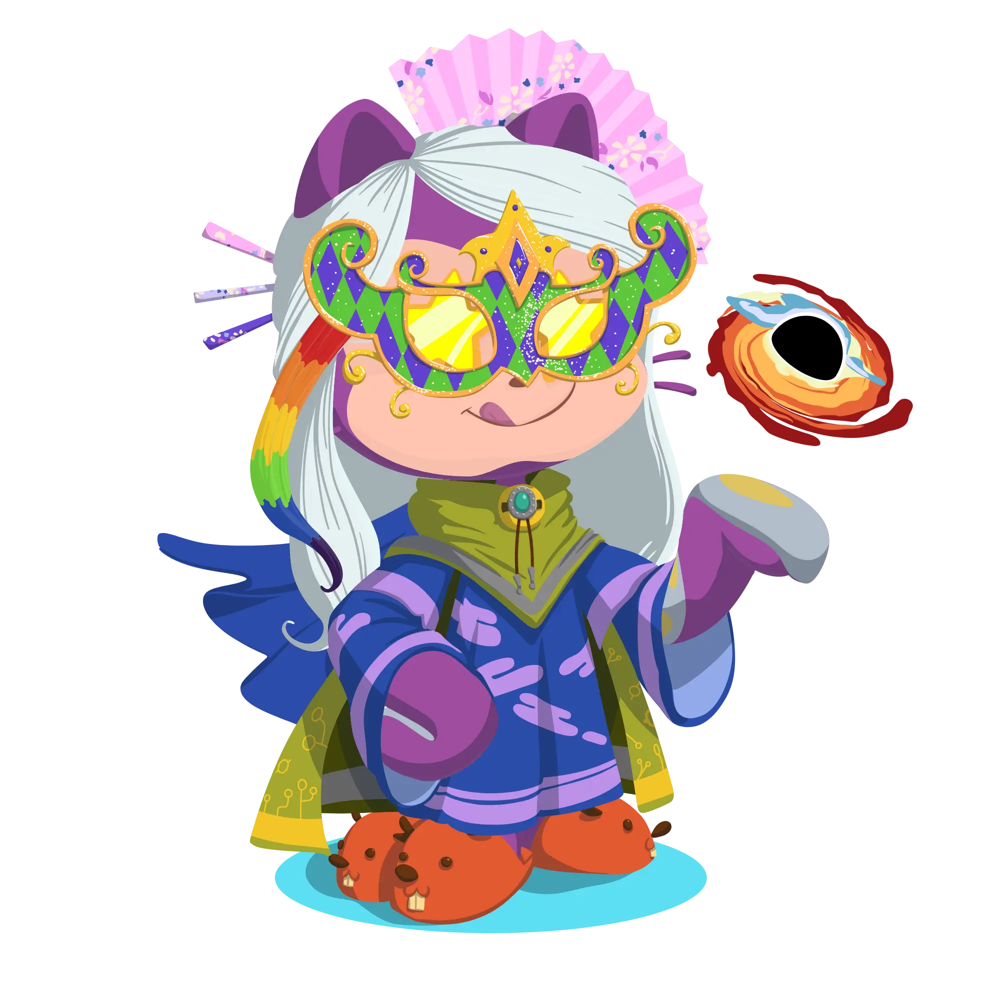

<div align="center">
  
  
  
</div>

<div align="center">
 
</div>

<div align="center">
  
</div>

<h3 align="center">🔖 A Passionate Software Developer based in Indonesia</h3>
<div align="center">
  <h3>☘️ Chasing a degree in informatics engineering while exploring the intricacies of coding</h3>
</div>
<div align="center">
  <h3>✨ Turning ideas into reality through clean and creative code</h3>
</div>

<div align="center">
 
</div>

</br>

<div align="center">
  
</div>

</br>

<div align="center">
   &nbsp;
   &nbsp;
   &nbsp;
   &nbsp;
   &nbsp;
   &nbsp;
   &nbsp;
   &nbsp;
   &nbsp;
   &nbsp;
   &nbsp;
   &nbsp;
   &nbsp;
   &nbsp;
   &nbsp;
</div>

<div align="center">
 
</div>

</br>

<table align="center">
<tr>
<th colspan="2">
&nbsp;&nbsp;&nbsp;&nbsp;&nbsp;&nbsp;&nbsp;&nbsp;&nbsp;&nbsp;&nbsp;&nbsp;&nbsp;&nbsp;&nbsp;&nbsp;&nbsp;&nbsp;&nbsp;&nbsp;&nbsp;&nbsp;&nbsp;&nbsp;&nbsp;&nbsp;&nbsp;&nbsp;&nbsp;&nbsp;&nbsp;&nbsp;&nbsp;&nbsp;&nbsp;&nbsp;&nbsp;&nbsp;&nbsp;&nbsp;&nbsp;&nbsp;&nbsp;&nbsp;&nbsp;&nbsp;&nbsp;&nbsp;&nbsp;&nbsp;&nbsp;&nbsp;&nbsp;&nbsp;&nbsp;&nbsp;&nbsp;&nbsp;&nbsp;&nbsp;&nbsp;&nbsp;&nbsp;&nbsp;&nbsp;&nbsp;&nbsp;&nbsp;&nbsp;&nbsp;&nbsp;&nbsp;&nbsp;&nbsp;&nbsp;&nbsp;&nbsp;&nbsp;&nbsp;&nbsp;&nbsp;&nbsp;&nbsp;&nbsp;&nbsp;&nbsp;&nbsp;&nbsp;&nbsp;&nbsp;&nbsp;&nbsp;&nbsp;&nbsp;&nbsp;&nbsp;&nbsp;&nbsp;&nbsp;&nbsp;&nbsp;&nbsp;&nbsp;&nbsp;&nbsp;&nbsp;&nbsp;&nbsp;&nbsp;&nbsp;&nbsp;&nbsp;&nbsp;&nbsp;&nbsp;&nbsp;&nbsp;&nbsp;&nbsp;&nbsp;&nbsp;&nbsp;&nbsp;&nbsp;&nbsp;&nbsp;&nbsp;
</th>
</tr>

<tr>
<td rowspan="3">

<pre>
heart-disease-detection/  
├─ data/
│  ├─ raw/                
│  ├─ processed/          
│  └─ external/           
├─ notebooks/             
│  └─ 01_eda_analysis.ipynb
├─ models/                
├─ src/                   
│  ├─ data_loader.py
│  ├─ preprocessing.py
│  └─ train_model.py
├─ reports/               
│  └─ figures/
├─ .gitignore             
├─ requirements.txt       
└─ README.md              
</pre>

</td>
<td>

```py
from typing import List

def evolve(priorities: List[str]) -> None:
    for focus in sorted(priorities):
        print(f"✨ [Evolve] Progressing: {focus}...")

if __name__ == "__main__":
    wisdom_path: List[str] = [
        "Mental Health", 
        "Consistency", 
        "Self-Love"
    ]
    
    evolve(wisdom_path)
```

</td>
</tr>

<tr><td></td></tr>

<tr>
<td colspan="2"><pre>&nbsp;&nbsp;Loading...</pre></td>
</tr>
</table>

<div align="center">
 
</div>

</br>


